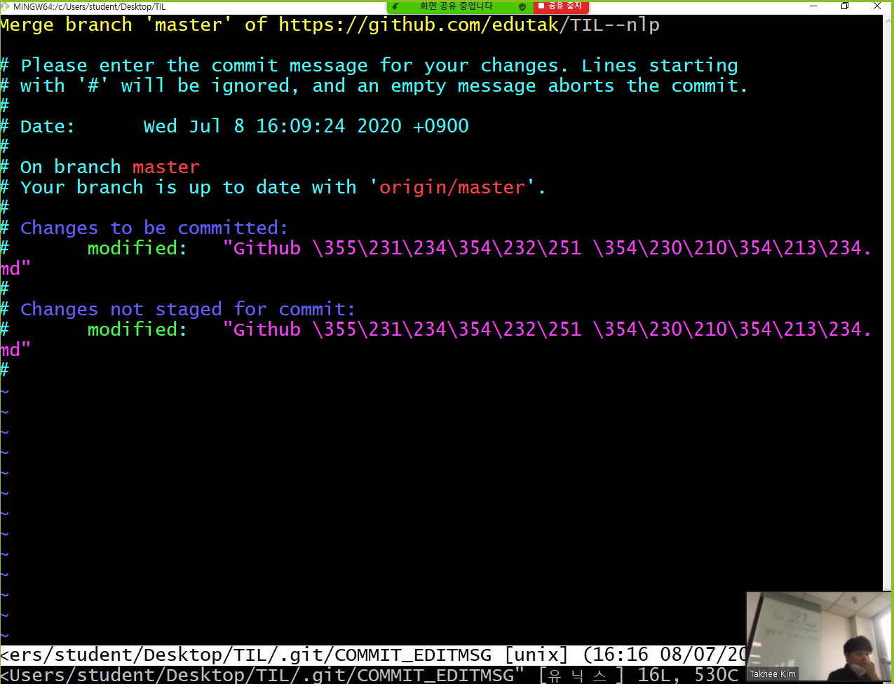

# Github 활용 예시

## `clone`

> 원격 저장소를 복제 해온다.

```bash
~/집 $ git clone https://github.com/edutak/TIL--nlp.git
~/집 $ cd TIL--nlp
~/집/TIL--nlp (master) $
```

* 복제 하는 경우 원격저장소 이름의 폴더가 생성된다.
* 해당 폴더로 이동하여 활용을 하면 된다.
* 이후 작업을 하는 경우 `add`, `commit`, `push`

## `pull` 

> 원격 저장소의 변경사항을 받아온다.

```bash
~/Desktop/TIL (master) $ git pull origin master
remote: Enumerating objects: 4, done.
remote: Counting objects: 100% (4/4), done.
remote: Compressing objects: 100% (3/3), done.
remote: Total 3 (delta 0), reused 3 (delta 0), pack-reused 0
Unpacking objects: 100% (3/3), 563 bytes | 5.00 KiB/s, done.
From https://github.com/edutak/TIL--nlp
 * branch            master     -> FETCH_HEAD
   b523707..187ed91  master     -> origin/master
Updating b523707..187ed91
Fast-forward
 ...hub \355\231\234\354\232\251 \354\230\210\354\213\234.md" | 12 ++++++++++++
 1 file changed, 12 insertions(+)
 create mode 100644 "Github \355\231\234\354\232\251 \354\230\210\354\213\234.md"

```

## 주의사항

> 원격 저장소와 로컬 저장소의 이력이 다르게 구성되는 경우
>
> 1) Github에서 직접 파일 수정을 하거나,
>
> 2) 협업하는 과정이거나,
>
> 3) 집-강의장 환경으로 왔다갔다 하는 상황 등 에서 발생할 수 있는 오류

```bash
$ git push origin master
To https://github.com/edutak/TIL--nlp.git
 ! [rejected]        master -> master (fetch first)
error: failed to push some refs to 'https://github.com/utak/TIL--nlp.git'
hint: Updates were rejected because the remote containsork that you do
hint: not have locally. This is usually caused by anoth repository pushing
hint: to the same ref. You may want to first integrate e remote changes
hint: (e.g., 'git pull ...') before pushing again.
hint: See the 'Note about fast-forwards' in 'git push -elp' for details.
```

* 이때, 원격 저장소 커밋 목록들과 로컬 저장소의 `git log --oneline` 으로 비교 해보면 다른 점이 반드시 있을 것이다.

* 해결 방법은 다음과 같다. 

  1) 원격 저장소 내용을 받아온다.

  ```bash
  $ git pull origin master
  remote: Enumerating objects: 5, done.
  remote: Counting objects: 100% (5/5), done.
  remote: Compressing objects: 100% (3/3), done.
  remote: Total 3 (delta 2), reused 0 (delta 0), pack-reud 0
  Unpacking objects: 100% (3/3), 704 bytes | 7.00 KiB/s, ne.
  From https://github.com/edutak/TIL--nlp
   * branch            master     -> FETCH_HEAD
     173cf24..68ec3f5  master     -> origin/master
  Merge made by the 'recursive' strategy.
   "Github \355\231\234\354\232\251 \354\230\210\354\213\
   1 file changed, 1 insertion(+)
  
  ```

  * 이때 Vim 편집기 화면이 뜨는데, 커밋 메시지를 작성할 수 있는 곳이다.
    * `esc` 를 누르고, `:wq` 를 순서대로 입력한다.



​	2) 다시 push를 한다.

```bash
$ git log --oneline
c30820c (HEAD -> master) Merge branch 'master' of https://github.com/edutak/TIL--nlp
e151783 Add README
68ec3f5 Update Github 활용 예시.md
173cf24 Update files
187ed91 Add clone command at home
b523707 Update git.md
6b6d274 Init
$ git push origin master
```


